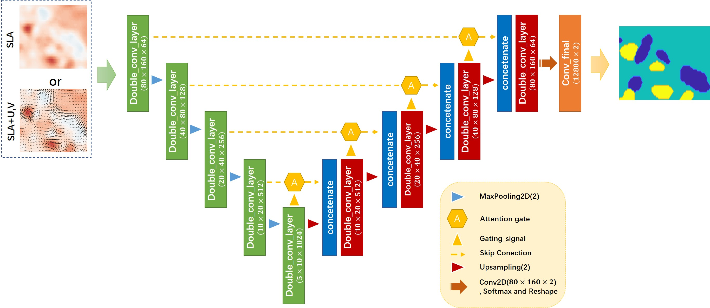
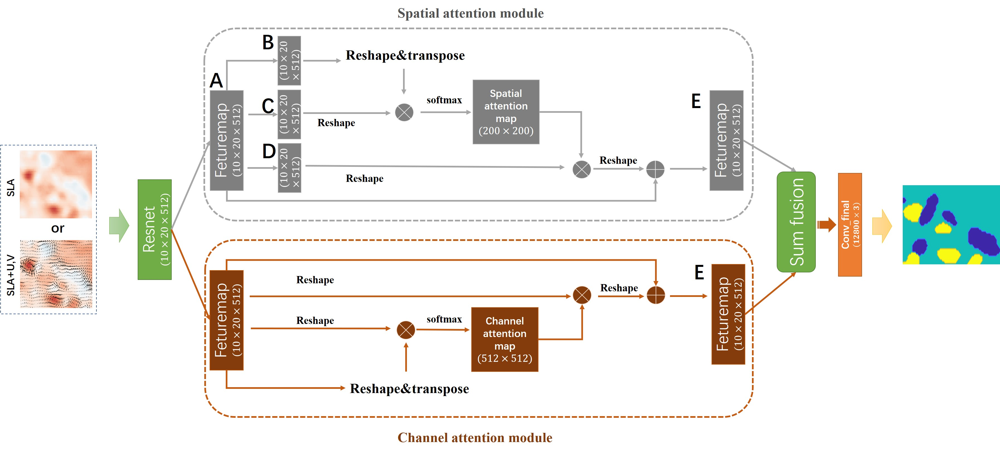

# eddy_bss_detection
Detection of Bering Sea Slope Mesoscale Eddies Derived from Satellite Altimetry Data by the Attention Network  

* Attresunet

`attresunet_onlysla.py` and `attresunet_suv.py` are used to train the Unet neural network with the addition of an attention mechanism.These two scripts use SLA data and SLA-geostrophic velocity fusion data respectively.  
  
`testatt_onlysla.py` and `testatt_suv.py` are used to evaluate the model and output detection results.  

* Danet

`danet_onlysla.py` and `danet_suv.py` are used to train the dual Attention Network.These two scripts use SLA data and SLA-geostrophic velocity fusion data respectively.  
`testdan_onlysla.py` and `testdan_suv.py` are used to evaluate the model and output detection results.    

  
  
* pre&post_process

`compare.m:` Comparison of the oceanic eddies detected by the four different algorithms in the BSs region on 09 September 2016.  
  
`cmm.m:` This script is used to complement the output of multiple models with each other.  
  
`label_vg_bsc.m:`This script is used to make the VG algorithm's eddy detection result into a label for model training.  
  
`modeltrack.m:`This script is used to convert the classification results from the model output into eddy coverage areas.  
  
`radius_lifetime.m:`This script is used to count the radius and lifetime of the eddy (A circle with a radius equal to the equal area of the eddy).  
  
 `snapshot.m:`This function is used to plot the eddy detection results for a particular day.    
    
 `sshset_bsc.m:`This script is used to interpolate SLA.   
    
 `tracksizelife_bsc.m:`This script is used to process and analysis the Lagrangian eddy tracking results.  
    
  `uvgeos_vg_bsc.m:`This script is to prepare the input data for the VG algorithm.
